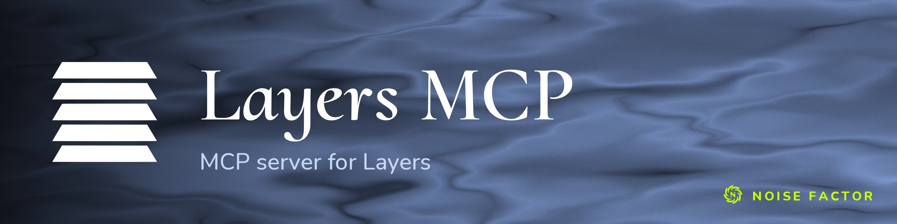

<!-- repo-hero -->
<a href="https://layers.noisefactor.io/"></a>

<sub>Open source from <a href="https://noisefactor.io">Noise Factor</a> &middot; <a href="https://github.com/noisefactorllc">more projects</a></sub>

# layers-mcp

MCP server for the [Layers](https://layers.noisefactor.io) image/video editor.

layers-mcp connects an MCP client (Claude Code, Cursor, Windsurf, etc.) to the
in-page `window.LayersAgent` API. It starts a persistent headless Chromium
session at the live Layers app. It exposes every LayersAgent command as an
MCP tool. The server loads tool schemas from the running page at startup.
Commands added in the `layers` repo appear here without code generation.

## Architecture

```
┌──────────────┐  stdio  ┌────────────┐  Playwright  ┌────────────────────┐
│  MCP client  │ ──────▶ │ layers-mcp │ ───────────▶ │ headless Chromium  │
│ (Claude etc) │ ◀────── │  (Node)    │ ◀─────────── │  page.evaluate()   │
└──────────────┘ JSON-RPC└────────────┘   downloads  └────────┬───────────┘
                                                              │ HTTPS
                                                              ▼
                                                     layers.noisefactor.io
```

The server uses one Chromium context for its lifetime. Tool handlers call
`page.evaluate(name, args)` against `window.LayersAgent` and return the
LayersAgent envelope (`{ ok, command, result, state }`) verbatim as a text
content block. Export tools also intercept the browser's download event and
splice a local `result.filePath` into the envelope.

## Setup

```bash
npm install
npm run setup    # downloads Playwright Chromium
npm run build
```

Node 18+ is required.

## Configuration

Environment variables control all configuration.

| Variable | Default | Description |
|----------|---------|-------------|
| `LAYERS_URL` | `https://layers.noisefactor.io` | URL of the Layers app to drive |
| `LAYERS_MCP_OUTPUT_DIR` | `$PWD/layers-mcp-exports` | Where `exportImage`/`exportVideo` write files. Exports never overwrite existing files. Repeated filenames become `shot-1.png`, `shot-2.png`, and so on. The envelope's `filePath` names the actual output file. Read that path. Do not assume a stable path. |
| `LAYERS_MCP_PROFILE_DIR` | `~/.cache/layers-mcp/profile` | Chromium user-data-dir (preserves saved projects, installed fonts, prefs) |
| `LAYERS_MCP_HEADFUL` | `false` | Set `true` to launch with a visible browser window |
| `LAYERS_MCP_LOG_LEVEL` | `info` | `debug` \| `info` \| `warn` \| `error` |

## Available Tools

Tools are not hand-coded. At startup, the server:

1. Loads the Layers page.
2. Imports `/js/agent/schemas.js`.
3. Enumerates `window.LayersAgent`.
4. Registers one MCP tool per public command.

Today the catalog is dozens of tools spanning state
inspection, layer manipulation, drawing, selections, masks, project lifecycle,
auto-corrections, font installation, and image/video export.

To list them at runtime, choose one:

- `LAYERS_URL=<url> npm run smoke` — boots the server and prints the
  `tools/list` JSON-RPC response.
- Send a JSON-RPC `tools/list` request over stdio to `dist/index.js`.
- Read `public/js/agent/index.js` in the `layers` repo, which is the
  authoritative registration list. Per-command input schemas live in
  `public/js/agent/schemas.js`.

Effect catalog responses use `effectId` (for example, `synth/gradient`).
Pass that value to `getEffectDefinition`, `addLayer` with `kind: "effect"`,
or child-effect tools.

New LayersAgent commands in the `layers` repo appear here automatically on
the next MCP-server restart. This repo has no code generation step.

## Client Integration

Replace `/absolute/path/to/layers-mcp/` with the actual checkout path.

### Claude Code

`~/.config/claude-code/mcp.json` (or via `claude mcp add`):

```json
{
  "mcpServers": {
    "layers": {
      "command": "node",
      "args": ["/absolute/path/to/layers-mcp/dist/index.js"],
      "env": {
        "LAYERS_URL": "https://layers.noisefactor.io",
        "LAYERS_MCP_OUTPUT_DIR": "/absolute/path/to/exports"
      }
    }
  }
}
```

A canonical copy of this block lives at `examples/claude-code.json`.

### Cursor

`.cursor/mcp.json`:

```json
{
  "mcpServers": {
    "layers": {
      "command": "node",
      "args": ["/absolute/path/to/layers-mcp/dist/index.js"],
      "env": {
        "LAYERS_URL": "https://layers.noisefactor.io",
        "LAYERS_MCP_OUTPUT_DIR": "/absolute/path/to/exports"
      }
    }
  }
}
```

### Windsurf

`~/.codeium/windsurf/mcp_config.json`:

```json
{
  "mcpServers": {
    "layers": {
      "command": "node",
      "args": ["/absolute/path/to/layers-mcp/dist/index.js"],
      "env": {
        "LAYERS_URL": "https://layers.noisefactor.io",
        "LAYERS_MCP_OUTPUT_DIR": "/absolute/path/to/exports"
      }
    }
  }
}
```

## Testing

Tests run against the Layers instance pointed to by `LAYERS_URL` (default:
`https://layers.noisefactor.io`). To target a local dev server instead,
use these steps:

1. In your layers checkout:
   ```
   npm run dev    # serves public/ on http://localhost:3002
   ```
2. In layers-mcp:
   ```
   LAYERS_URL=http://localhost:3002 npm test
   ```

`npm test` runs `npm run build && vitest run`. The build step is required
because `tests/index.test.ts` starts `dist/index.js` to test the real
stdio JSON-RPC server. To skip the build when iterating on a non-stdio test,
run `LAYERS_URL=... npx vitest run` directly.

### End-to-end smoke

`scripts/smoke.mjs` (run as `npm run smoke`) starts the built binary. It sends
real `tools/list` and `tools/call` (`getState`) requests. It checks that the
responses are valid MCP envelopes. This provides a reproducible check in
addition to the vitest suite.

```bash
npm run build
npm run smoke    # or LAYERS_URL=http://localhost:3002 npm run smoke
```

## Development

```bash
npm test          # vitest run
npm run dev       # tsup watch
npm run build     # production build (prepends shebang)
```

## Known Limitations

- **`exportVideo` cancellation is best-effort.** Once the video encoder is
  running, an in-flight cancel may not abort cleanly.
- **First `installFontBundle` call downloads ~140 MB** into the headless
  browser. The persistent profile caches the bundle for subsequent calls.
  In-page `fetch()` loads the bundle into IndexedDB, without the browser's
  download pipeline. layers-mcp blocks the MCP call until the install job
  completes. It does not intercept the download at the network layer, so it
  produces no local file.
- **`exportImage` with zero downloads.** The export-tool wrappers wait up to
  120 s for a browser download to fire. If the underlying command returns
  successfully but never triggers a download, the wrapper blocks for the
  full timeout. For example, an in-progress export may have been cancelled.
  The wrapper then returns the LayersAgent envelope with `filePath: null`.
  Concurrent export calls run serially so they do not interfere with each
  other. The zero-download case still waits for the full timeout.
- **A browser crash mid-export can drop the local file.** If headless Chromium
  crashes during an `exportImage`/`exportVideo` action, layers-mcp recovers the
  browser and the command still reports success. A download that already
  completed before the crash keeps its saved path. If the crash precedes
  the download, the download arrives on the new page without a listener and
  is not saved. The path (`result.filePath`, or `result.result.filePath` for
  `exportVideo`) is then absent. Run the export again to capture the file.
- **Browser profile persists across MCP runs.** `LAYERS_MCP_PROFILE_DIR`
  (default `~/.cache/layers-mcp/profile`) keeps saved projects, installed
  fonts, and preferences between sessions. Delete the directory if you want
  an empty profile.

## License

MIT
